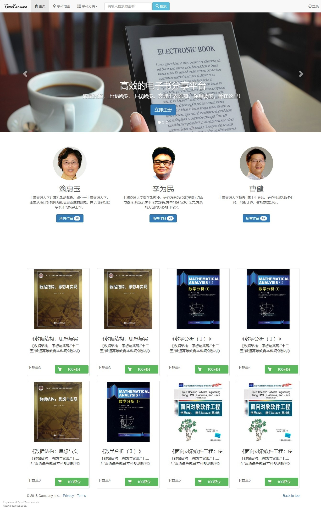
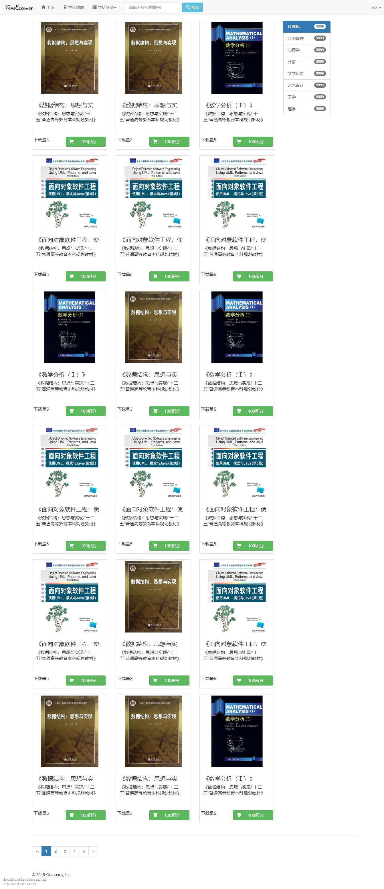
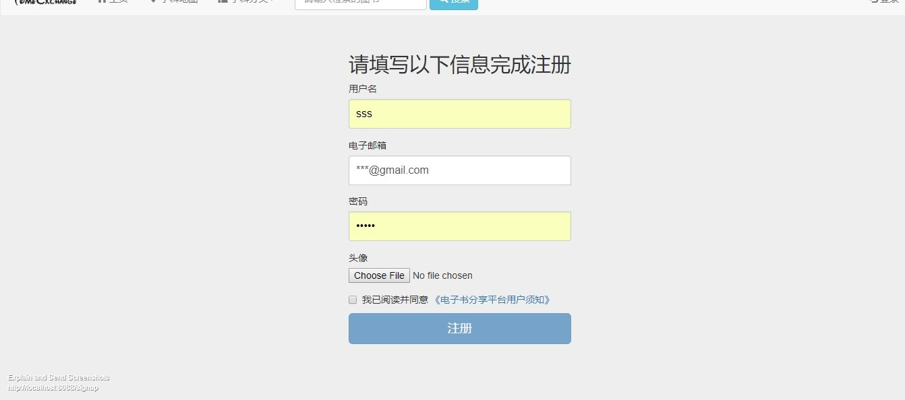
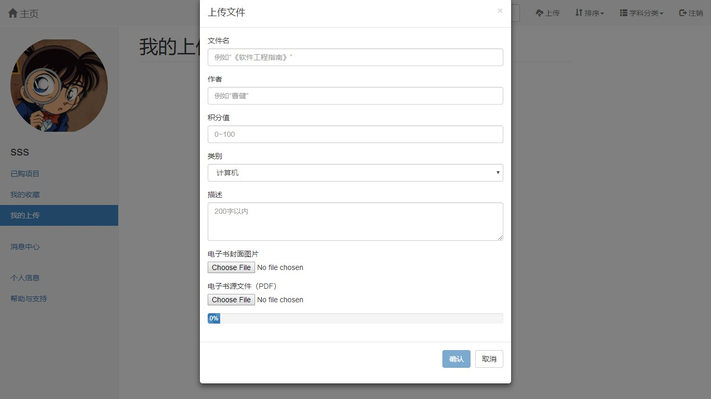
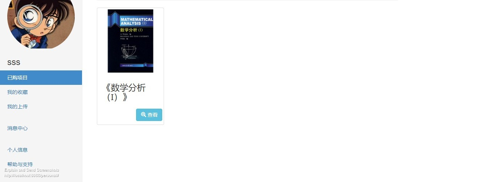
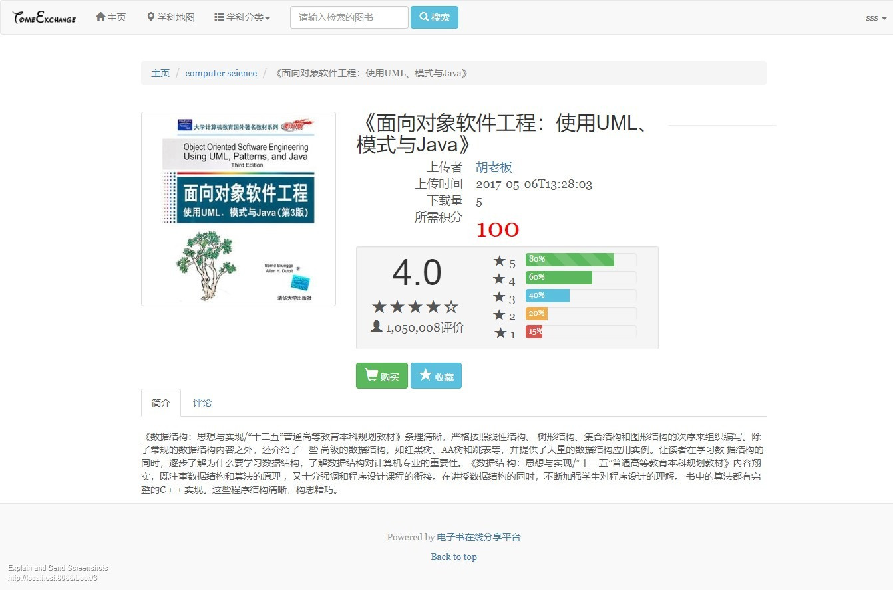

# TomeExchange
## Prerequisite
Python 2.x  
Flask
## Introduction
Course project for Software Engineering. A simple E-book sharing platform built on Flask and Microsoft SQL server.
We use RESTful architecture and divide word load into Front-end, Server and 
Database. My contribution is mainly based on web server construction.
## Feature
* Signup and verify email address like real web application
* Easily upload and share your e-book
* Course map helps you organize your knowledge
## Demonstration
### Main page

### Book list page

### Signup page

### Upload page

### Profile page

### Book information page

### Knowledge map page
https://v.vzuu.com/video/982562661191639040

